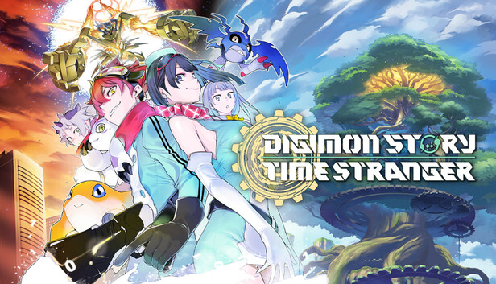

# 🎮 DSTS - Digimon Story Time Stranger



Projeto de página interativa inspirado no jogo **Digimon Story Time Stranger**, com visual imersivo, animações e interação personalizada para entreter os visitantes de forma criativa.

[🔗 DSTS - Digimon Story Time Stranger](https://regirako.github.io/DSTS-DigimonStoryTimeStranger/)

---

## 📦 Estrutura do Projeto

```
DSTS-DigimonStoryTimeStranger/
├── index.html             # Página principal do site
├── style.css              # Estilos visuais (cores, fontes, layout)
├── assets/                # Arquivos de mídia usados no site
│   ├── banner.jpg         # Banner do jogo
│   ├── pattern.png        # Fundo animado em padrão repetido
│   └── seu-video.mp4      # Vídeo reproduzido ao clicar no botão
```

---

## 🧠 Funcionalidade

- Página simulando o download de um jogo.
- Botão "Download Digimon Story Time Stranger [FitGirl Repacks]" inicia a transição para um vídeo em tela cheia (modo simulado).
- O vídeo é exibido cobrindo toda a janela do navegador e **não pode ser pausado**.
- Fundo com padrão animado (pattern).
- Estilo escuro com botão azul marinho e texto em branco.
- Link direto para a **Loja da Steam** do jogo.
- Informações adicionais do jogo exibidas de forma organizada.

---

## 🖼️ Preview


---

## 🔗 Link da Steam

[🔗 Loja da Steam - Digimon Story Time Stranger](https://store.steampowered.com/app/1984270/Digimon_Story_Time_Stranger/)

---

## 🛠️ Tecnologias Utilizadas

- HTML5
- CSS3 (Responsivo e estilizado)
- JavaScript puro (sem frameworks)

---

## 🚀 Como Rodar o Projeto

1. Baixe ou clone este repositório:
   ```bash
   git clone https://github.com/seu-usuario/DSTS-DigimonStoryTimeStranger.git
   ```

2. Coloque seu vídeo na pasta `assets/` com o nome:  
   ```seu-video.mp4```

3. Abra o arquivo `index.html` no navegador.

---

## 📌 Observações

> Este projeto foi feito para fins recreativos, sem fins comerciais.  
> Inspirado em memes antigos, com o objetivo de entreter alguns amigos com uma brincadeira criativa e inofensiva.

---

## 🧊 Licença

Este projeto é apenas para uso pessoal e não possui licença comercial.

---

Criado com 🎧 por [@regirako](https://github.com/regirako)
